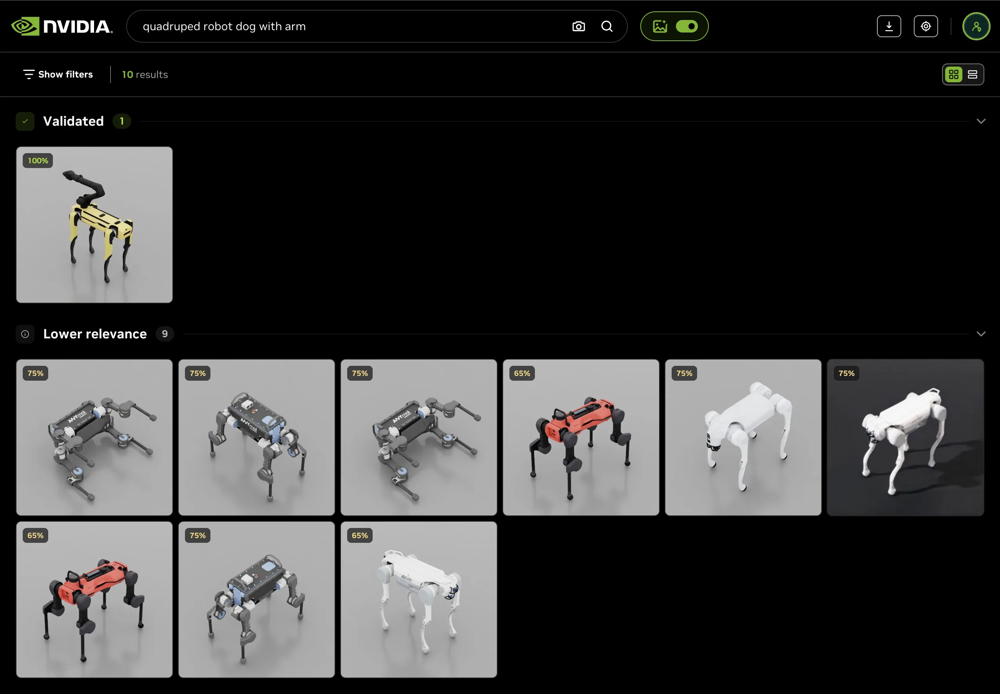
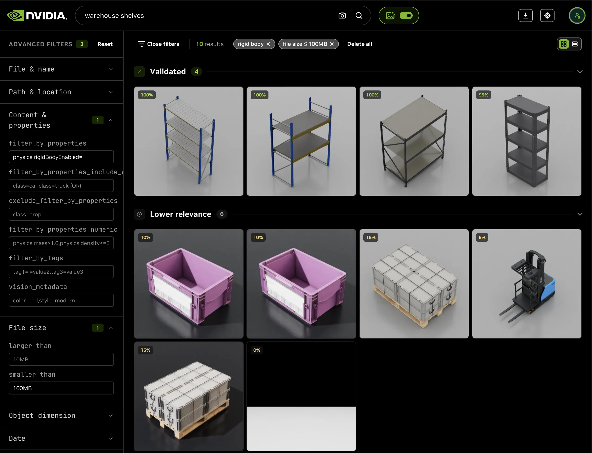
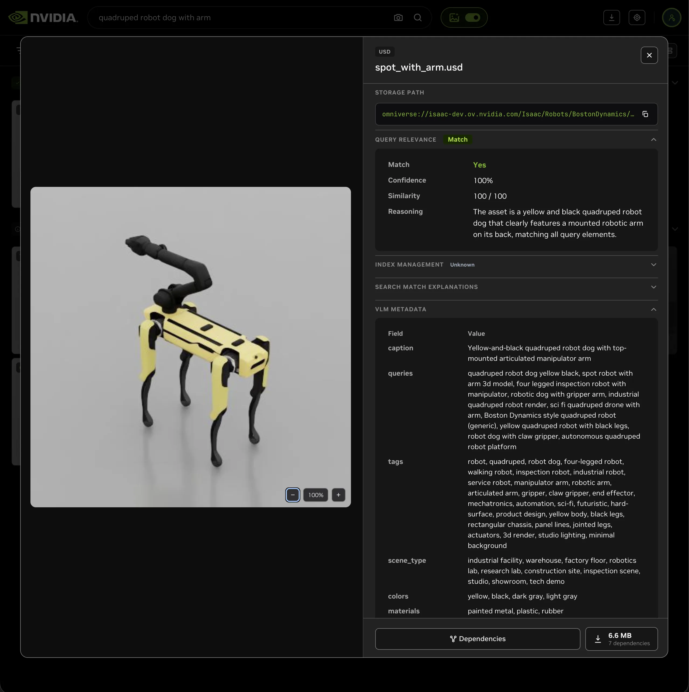

[](LICENSE)
[](https://nvidia-omniverse.github.io/usd-search/)

# USD Search

**USD Search** lets developers, creators, and workflow specialists find 3D assets across an entire library and navigate the structure of individual scenes.

<p align="center">
  
  <br>
  <em><strong>Find any 3D asset in natural language.</strong> Describe what you're looking for, like "quadruped robot dog with arm", and USD Search surfaces the matching USD assets from across your library, even when filenames don't contain the words.</em>
</p>

## Features

- **Semantic search.** Find assets by meaning rather than by filename: SigLIP2 embeddings match your text, or a dragged-in reference image, against how every asset actually looks, so the right model surfaces even when your words never appear in the path. On its own that is pure semantic ranking; blended with keyword matching it becomes hybrid search.

- **Hybrid search.** The default mode combines that semantic similarity with a keyword match over each asset's auto-generated captions and tags, then blends the two scores, so you find the right asset whether you describe what it looks like or type the exact words. See [`docs/search-filters.md`](docs/search-filters.md).

- **Auto-generated vision metadata and captions.** During ingestion a VLM writes captions, tags, materials, and style for every asset, giving hybrid search and the filters real text to match on, so assets stay findable even with an unhelpful filename or no authored metadata. The schema is fully configurable.

- **Search inside scenes.** Inspect the structure of a single scene with the Asset Graph Service: spatial proximity and bounding-box queries, prim and property filters, and forward and reverse dependency lookups (what a scene references, and where an asset is used). See [`services/asset-graph/README.md`](services/asset-graph/README.md).

- **Connect any storage.** S3, a [Storage API](https://docs.omniverse.nvidia.com/ovstorage/ovstorage-guide/latest/index.html), or [Omniverse Nucleus](https://docs.omniverse.nvidia.com/nucleus/latest/index.html); assets are discovered and indexed at scale.

## Use USD Search with Claude / Codex Desktop

Use Claude or Codex Desktop as your search UI: install the USD Search skills, point the agent at our public-hosted instance or your own deployment, and search in natural language. The agent calls the same REST APIs described below, validates the results, and shows the matching thumbnails inline. See the [Agent Desktop search guide](docs/agent-desktop/search/README.md) to get started, or [`docs/agent-skills.md`](docs/agent-skills.md) for the full Claude Code and Codex skill set.

Start with a short description such as `$search yellow forklift on https://search.simready.omniverse.nvidia.com`, add a reference image for visual similarity, or combine both.

Natural-language constraints work too: ask for `$search road signs under 5MB`, or catalog a deployment's USD properties with `$usd-property-catalog` and then query `$search containers with PhysX pipeline passed`. The skill maps supported constraints to structured filters and flags anything the deployment cannot apply.

Results are hybrid-ranked and checked against precomputed vision captions before they are shown. From any result you can inspect the asset or run spatial and prim-level queries inside its scene — see the [Agent Desktop search guide](docs/agent-desktop/search/README.md) for these follow-up workflows and the Claude command equivalents.

<p align="center">
  
  
  
  <br>
  <em><strong>Natural-language filters.</strong> Ask for "road signs under 5MB" and the agent returns only validated assets that satisfy the indexed file-size constraint.</em>
</p>

## Use USD Search in a sample WebUI

The Explorer is another way to search for USD assets, with all functionality also available over the REST API. Downloading an asset with all its dependencies as a self-contained bundle is a beta feature. See [Beta features](#beta-features) below.

Start from a single search bar: search by keywords, describe what you want in natural language, drag in a reference image, or add filters with a few clicks. A built-in LLM query parser can also read a request like "warehouse shelves with rigid body physics under 100MB" and turn each constraint into a structured filter for you. This is a **beta** capability; see [Beta features](#beta-features) below.

Results come back as a hybrid-ranked visual grid. An optional vision-model (VLM) validation pass reviews the top matches, sorting them into **Validated** and **Lower relevance** with confidence scores and short explanations, so you know why an asset was selected. Browse the grid as a mosaic or a dense index list.

Open any asset to explore its auto-generated captions, tags, USD scene summary, and per-query relevance. Two beta previews go further: an interactive dependency-graph view, and one-click download of the asset with every referenced USD and texture as a self-contained ZIP. See [Beta features](#beta-features) below.

Everything above is also a REST call, so the same flow runs without the UI — hybrid search, thumbnails, query parsing, VLM validation, scene and dependency inspection, and bundled download each map to a documented endpoint. Swagger is served at `/docs/`, and the full hosted [API reference](https://nvidia-omniverse.github.io/usd-search/) documents every route.

<p align="center">
  
  <br>
  <em><strong>Natural-language → structured filters (beta).</strong> Constraints like "rigid body physics" are lifted into removable filter chips over a per-deployment catalog, or you can pick them yourself from the advanced-filter rail.</em>
</p>

<p align="center">
  
  <br>
  <em><strong>Auto-generated metadata.</strong> Every asset gets a caption, tags, a USD scene summary, colors, materials, and per-query relevance, all generated at ingest and shown in a zoomable detail view.</em>
</p>

## Quickstart

Try it yourself against the public NVIDIA-hosted instance at `https://search.simready.omniverse.nvidia.com` with a single shell command, no install required:

```bash
./scripts/quickstart.sh --hosted --query "yellow forklift"
```

> [!TIP]
> If you're using Claude Code or Codex in this repo, you can ask in natural language instead, like _"find a yellow forklift"_, and the agent dispatches the right skill. See [`docs/agent-skills.md`](docs/agent-skills.md) for the full set.

## Deploy locally

Deploy the USD Search stack on your own hardware with one command, which brings up the search, info, and asset-graph APIs plus Swagger at `/docs/`:

```bash
docker compose -f docker-compose.yml -f docker-compose.gpu-plugins.yml up -d --build
```

Open http://localhost:8080. By default `/` redirects to `/docs/` (Swagger). After the stack reports healthy (~60s), [`./scripts/quickstart-smoke.sh`](scripts/quickstart-smoke.sh) exercises every gateway-proxied endpoint.

### Requirements

| Component | Required version |
|---|---|
| OS | Linux |
| Docker Compose | v2.26 or newer |
| NVIDIA GPU | with [`nvidia-container-toolkit`](https://github.com/NVIDIA/nvidia-container-toolkit) configured |

To run without a GPU (SigLIP2 on CPU, no renderer), drop the `-f docker-compose.gpu-plugins.yml` flag.

For the full local-deployment guide (VLM auto-tagging, custom S3 buckets, local-filesystem assets, Nucleus, Explorer WebUI), see [`docs/local-deployment.md`](docs/local-deployment.md).

> [!TIP]
> **Guided setup with an agent:** Claude Code or Codex can walk through the same flow interactively (storage backend, GPU/VLM plugins, credentials), then hand back to a sample query. See [`docs/agent-skills.md`](docs/agent-skills.md).

**Scalable deployment (Kubernetes):** for production, a Kubernetes cluster is required. USD Search ships a Helm chart at [`helm/usdsearch/`](helm/usdsearch/), also published to the [NGC Catalog](https://catalog.ngc.nvidia.com/orgs/nvidia/teams/usdsearch/helm-charts/usdsearch). See [`helm/usdsearch/README.md`](helm/usdsearch/README.md) for the full installation guide.

**Improving search quality:** the methodology for retrieval experiments (comparing embeddings, sweeping ranking configs, evaluating with the benchmark or the VLM judge) lives in [`docs/search_research_playbook.md`](docs/search_research_playbook.md).

## Beta features

These Explorer capabilities are early-access previews: they work today, but their interfaces and behavior may change in upcoming releases. Full walkthroughs and demos are in [`docs/beta.md`](docs/beta.md).

- **Natural-language query parsing and filter interpretation.** An LLM reads a plain-language request, like "warehouse shelves with rigid body physics under 100MB", and infers both the search query and the filters you'd want applied to it, mapping each constraint onto a structured filter surfaced as a removable chip. See [`docs/beta.md`](docs/beta.md) and [`docs/search-filters.md`](docs/search-filters.md).

- **Asset Graph Service dependency-graph view.** Explore an asset's sublayers, references, textures, and forward and reverse dependencies as an interactive, zoomable graph. See [`docs/beta.md`](docs/beta.md).

- **One-click bundled download.** Download any asset as a self-contained ZIP with all its transitive dependencies, folder structure preserved. See [`docs/beta.md`](docs/beta.md) and [`docs/asset-download.md`](docs/asset-download.md).

## Documentation

The full documentation index lives in [`docs/README.md`](docs/README.md). The essentials:

- **Using** — [search filters](docs/search-filters.md), [VLM validation](docs/vlm-validation.md), [scene queries](services/asset-graph/README.md), [asset download](docs/asset-download.md)
- **Operating** — [local deployment](docs/local-deployment.md), [Helm / Kubernetes](helm/usdsearch/README.md), [models & config](docs/models-and-config.md)
- **Contributing & research** — [development guide](docs/development.md), [search research playbook](docs/search_research_playbook.md), [benchmark](benchmark/README.md)
- **Agents** — [Claude Code and Codex skills](docs/agent-skills.md): the most capable path — reformulating queries, comparing multiple searches, chaining in the asset-graph endpoints, and showing thumbnails inline

---

## License

Licensed under the [Apache License, Version 2.0](LICENSE). Third-party
component licenses are listed in [THIRD_PARTY_NOTICE.md](THIRD_PARTY_NOTICE.md).

## Contributing

This project is currently not accepting contributions. See
[CONTRIBUTING.md](CONTRIBUTING.md).

## Security

Please report security vulnerabilities per the policy in
[SECURITY.md](SECURITY.md).

## Code of Conduct

This project adheres to the Contributor Covenant Code of Conduct. See
[CODE_OF_CONDUCT.md](CODE_OF_CONDUCT.md).
