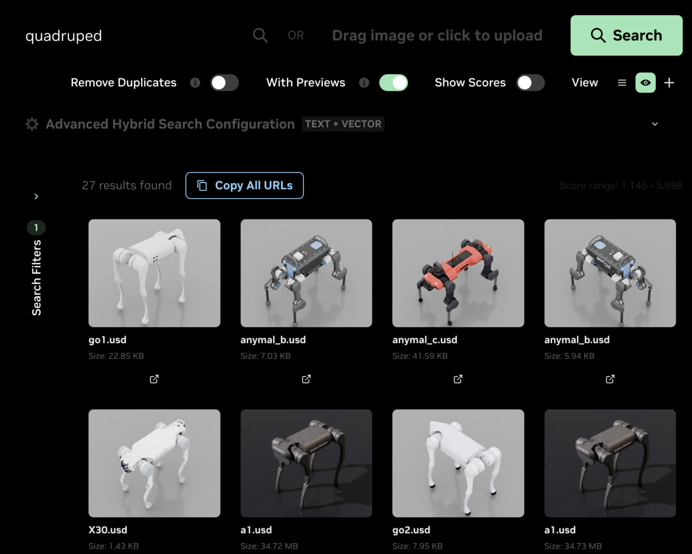
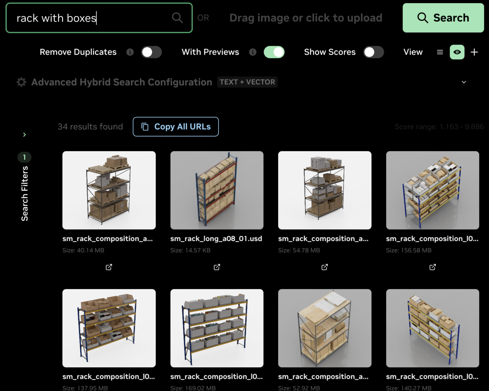

# USD Search

[](LICENSE)
[](https://docs.omniverse.nvidia.com/services/latest/services/usd-search/overview.html)
[](https://nvidia-omniverse.github.io/usd-search/)

**USD Search** lets developers, creators, and workflow specialists search large collections of [OpenUSD](https://openusd.org/) and 3D assets using natural-language descriptions or reference images — without any manual tagging. It covers both flat-list search across an asset library and structural navigation within individual scenes:

- **Search by description** — natural-language queries surface matching USD assets, renders, and reference images even when filenames don't contain the keywords.
- **Search by example** — supply a reference image to find visually similar 3D assets. Useful for "more like this" or matching a target look.
- **Search inside scenes** — spatial queries within a USD file, prim and property filters, and forward / reverse dependency lookups across the asset graph.
- **Auto-generated metadata** — captions, tags, materials, and style are produced for every asset during ingestion. The metadata schema is fully configurable.
- **Quality-checked results** — irrelevant matches are filtered out so what surfaces actually matches the query.
- **Connect to your storage** — point USD Search at S3, a [Storage API](https://docs.omniverse.nvidia.com/ovstorage/ovstorage-guide/latest/index.html), or [Omniverse Nucleus](https://docs.omniverse.nvidia.com/nucleus/latest/index.html); assets are discovered and indexed at scale.

<p align="center">
  
  
</p>

## Quickstart

Try it yourself against the public NVIDIA-hosted instance at `https://search.simready.omniverse.nvidia.com` with a single shell command — no install:

```bash
./scripts/quickstart.sh --hosted --query "yellow forklift"
```

> [!TIP]
> If you're using Claude Code or Codex in this repo, you can ask in plain language instead — _"find a yellow forklift"_ — and the agent dispatches the right skill. See [`docs/agent-skills.md`](docs/agent-skills.md) for the full set.

## Deploy locally

Deploy the USD Search stack on your own hardware with one command — the search / info / asset-graph APIs plus Swagger at `/docs/`:

```bash
docker compose -f docker-compose.yml -f docker-compose.gpu-plugins.yml up -d --build
```

Open http://localhost:8080 — by default `/` redirects to `/docs/` (Swagger). After the stack reports healthy (~60s), [`./scripts/quickstart-smoke.sh`](scripts/quickstart-smoke.sh) exercises every gateway-proxied endpoint.

### Requirements

| Component | Required version |
|---|---|
| OS | Linux |
| Docker Compose | v2.26 or newer |
| NVIDIA GPU | with [`nvidia-container-toolkit`](https://github.com/NVIDIA/nvidia-container-toolkit) configured |

To run without a GPU (SigLIP2 on CPU, no renderer), drop the `-f docker-compose.gpu-plugins.yml` flag.

For the full local-deployment guide — VLM auto-tagging, custom S3 buckets, local-filesystem assets, Nucleus, Explorer WebUI — see [`docs/local-deployment.md`](docs/local-deployment.md).

> [!TIP]
> **Guided setup with an agent:** Claude Code or Codex can walk through the same flow interactively (storage backend, GPU/VLM plugins, credentials), then hand back to a sample query. See [`docs/agent-skills.md`](docs/agent-skills.md).

**Scalable deployment (Kubernetes):** for production, a Kubernetes cluster is required. USD Search ships a Helm chart at [`helm/usdsearch/`](helm/usdsearch/), also published to the [NGC Catalog](https://catalog.ngc.nvidia.com/orgs/nvidia/teams/usdsearch/helm-charts/usdsearch). See [`helm/usdsearch/README.md`](helm/usdsearch/README.md) for the full installation guide.

---

## License

Licensed under the [Apache License, Version 2.0](LICENSE). Third-party
component licenses are listed in [THIRD_PARTY_NOTICE.md](THIRD_PARTY_NOTICE.md).

## Contributing

This project is currently not accepting contributions. See
[CONTRIBUTING.md](CONTRIBUTING.md).

## Security

Please report security vulnerabilities per the policy in
[SECURITY.md](SECURITY.md).

## Code of Conduct

This project adheres to the Contributor Covenant Code of Conduct. See
[CODE_OF_CONDUCT.md](CODE_OF_CONDUCT.md).
