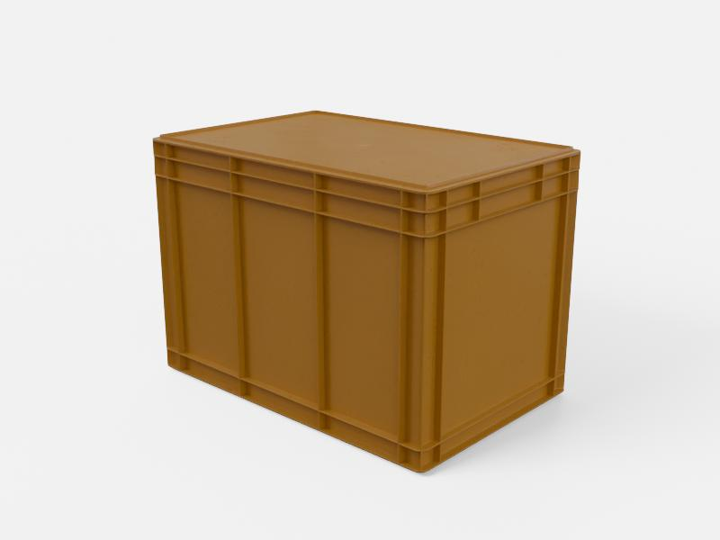
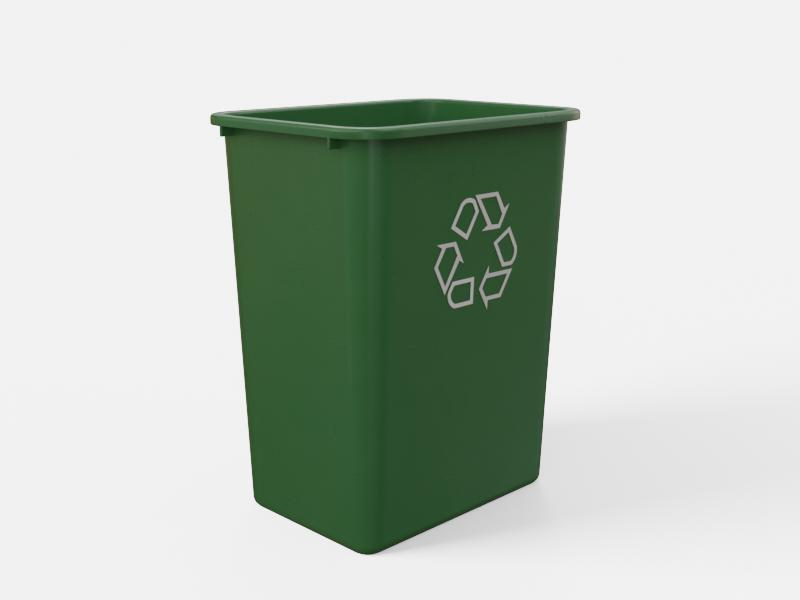
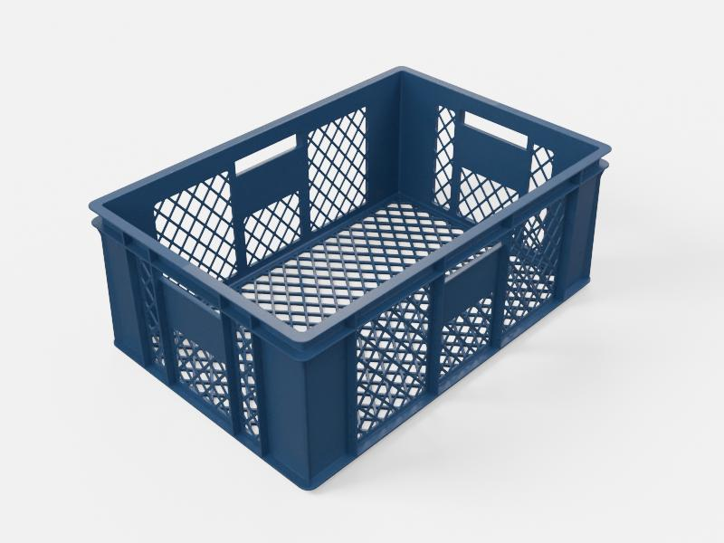
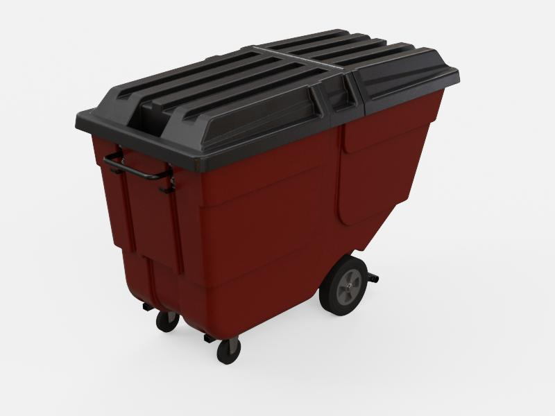

# Agent Desktop search guide

Use the **search** skill when you want your agent to find USD assets by text,
image, or both. This guide works the same way in **Claude Desktop** and **Codex
Desktop** — it invokes the shared skill under `skills/search/`. This guide uses
the public hosted USD Search instance:

```text
https://search.simready.omniverse.nvidia.com
```

Throughout this guide, invoke the skill with the prefix your agent uses:

- **Claude** — `/search`, `/inspect-asset`, `/usd-property-catalog`, `/search-in-scene`
- **Codex** — `$search`, `$inspect-asset`, `$usd-property-catalog`, `$search-in-scene`

The examples below use the `$` (Codex) form; substitute `/` if you are in
Claude.

## Prerequisites

- Claude Desktop or Codex Desktop installed and signed in.
- Network access to the hosted USD Search instance.

## Install the USD Search skills

The skills live in the public repo and are shared by both agents:

```text
https://github.com/NVIDIA-omniverse/usd-search
```

**Codex.** Start Codex in any workspace and paste this prompt:

```text
$skill-installer install these USD Search skills from GitHub using git sparse checkout (--method git):
repo: NVIDIA-omniverse/usd-search
paths:
- skills/search
- skills/usd-property-catalog
- skills/inspect-asset
- skills/search-in-scene
```

Approve GitHub network access if the agent asks for permission. If the skills do
not appear immediately after installation, restart the agent.

**Claude Desktop.** Claude Desktop cannot install skills straight from GitHub —
you upload each skill as a ZIP. For each of the four folders (`skills/search`,
`skills/usd-property-catalog`, `skills/inspect-asset`, `skills/search-in-scene`):

1. Download the folder from the repo above.
2. Zip it so the folder itself sits at the root of the ZIP (the archive must
   contain `<skill>/SKILL.md`, not a bare `SKILL.md`).
3. In Claude Desktop, go to **Customize → Skills → “+ Create skill”** and upload
   the ZIP.

Restart Claude Desktop if the skills do not appear. The skill bodies are
identical to the ones Codex installs.

## Search

Run:

```text
$search yellow forklift on https://search.simready.omniverse.nvidia.com (no auth required)
```

For follow-up searches in the same conversation, you do not need to repeat the
endpoint; it is already part of the conversation context.

Good text queries are usually short: two to five words.

## Search with filters

Natural-language filter parsing depends on the deployment. When the parser is
available, include the constraints directly in your query:

```text
$search road signs under 5MB
```

On the hosted instance, this query returned compact road-sign assets under 5 MB:

<p>
  
  
  
</p>

The search skill parses these constraints before running hybrid search when the
deployment exposes a filter catalog. Otherwise, it falls back to plain hybrid
search.

For better control, discover the deployment's real USD property keys and values
first:

```text
$usd-property-catalog on this instance https://search.simready.omniverse.nvidia.com
```

This discovers the USD properties and values available in the hosted index so
subsequent filter queries use metadata the corpus actually contains.

Property constraints can also target pipeline validation results:

```text
$search containers with PhysX pipeline passed
```

On the hosted instance, this query returned containers whose PhysX validation
pipeline passed:

<p>
  
  
  
  
</p>

## Search from a reference image

Give the agent a local image path and ask it to search visually similar assets:

```text
$search find assets visually similar to ./reference-images/chair.jpg
```

You can also combine visual similarity with text:

```text
$search find assets like ./reference-images/chair.jpg but red
```

## Find more assets like a result

Run a search first:

```text
$search red vehicle
```

Then ask the agent to use the previous result manifest:

```text
$search find more assets visually similar to rank 2 from the previous search
```

Expected result: the agent reads the previous `manifest.json`, uses the selected
result as the visual reference, and searches again.

## Follow-up workflows

If you installed `$inspect-asset`, inspect one returned asset URL:

```text
$inspect-asset <asset-url-from-search-results>
```

If you installed `$search-in-scene`, query inside one returned scene:

```text
$search-in-scene <scene-url> summarize the scene and list root prims
```

Those follow-up skills use the same `USD_SEARCH_API_URL` environment variable.
