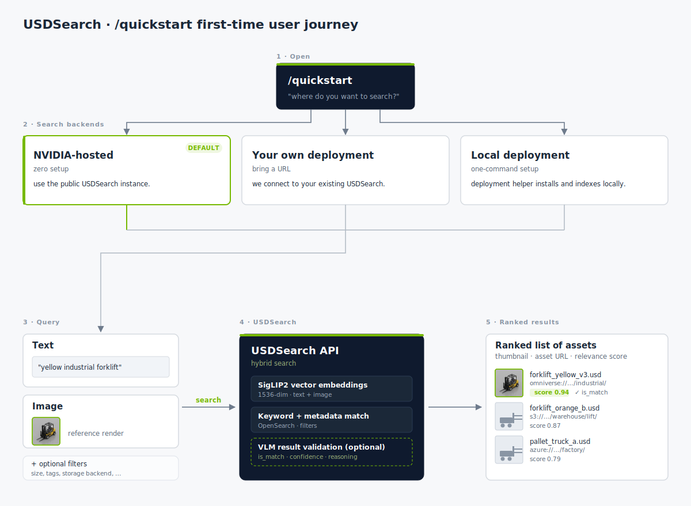

# Agent skills

This repo ships agent skills for Claude Code and Codex that wrap the
search, inspection, and deployment workflows interactively. They are
entirely optional — every path in the main [README](../README.md) works
without them.

Both agents share one source of truth at [`skills/`](../skills/);
`.claude/skills` and `.codex/skills` are compat symlinks pointing at it.
The skill bodies are written agent-neutrally — Codex's `AGENTS.md`
runtime notes map the generic verbs (e.g. "inspect the thumbnails") onto
Codex-specific mechanics like `codex exec --image`.

  

| Claude Code | Codex | What it does |
|---|---|---|
| [`/quickstart`](../skills/quickstart/SKILL.md) | [`$quickstart`](../skills/quickstart/SKILL.md) | Pick a backend (NVIDIA-hosted / your URL / local) and get to a first asset. |
| [`/search`](../skills/search/SKILL.md) | [`$search`](../skills/search/SKILL.md) | Hybrid text + image search over the index; saves top-5 VLM-validated thumbnails to `./search-results/`. |
| [`/inspect-asset`](../skills/inspect-asset/SKILL.md) | [`$inspect-asset`](../skills/inspect-asset/SKILL.md) | Deep-dive one asset URL: thumbnails, indexing status, scene structure, dependencies, VLM relevance. |
| [`/search-in-scene`](../skills/search-in-scene/SKILL.md) | [`$search-in-scene`](../skills/search-in-scene/SKILL.md) | Spatial / scene-graph queries inside a USD: radius, bounding box, prim-type filters, where-used. |
| [`/deploy-usdsearch`](../skills/deploy-usdsearch/SKILL.md) | [`$deploy-usdsearch`](../skills/deploy-usdsearch/SKILL.md) | Stand up a local docker compose stack or Helm deployment, then hand back to `/quickstart`. |

Open this repo in your agent of choice and type one of the slash / dollar
commands above. With an agent active in the repo you can also skip the
explicit command and ask in plain language ("find a yellow forklift",
"more like this beverage") — the agent dispatches the right skill.

Filter-heavy queries ("usda forklifts with rigid body physics") go through the
deployment's filter catalog — `/search` parses them via `/llm_parse/query`;
the available filters per deployment are described in
[`search-filters.md`](search-filters.md).

**About `/deploy-usdsearch`:** branches once between **local docker
compose** and **Helm on Kubernetes**, then walks through storage backend
(Public S3 / Custom S3 / Nucleus), GPU plugins, VLM plugins, WebUI, and
credentials — accepting **env-var names only**, never raw secrets. After
the stack is healthy and
[`./scripts/quickstart-smoke.sh`](../scripts/quickstart-smoke.sh) passes,
control returns to `/quickstart` so you can immediately fetch an asset
against your own deployment.
