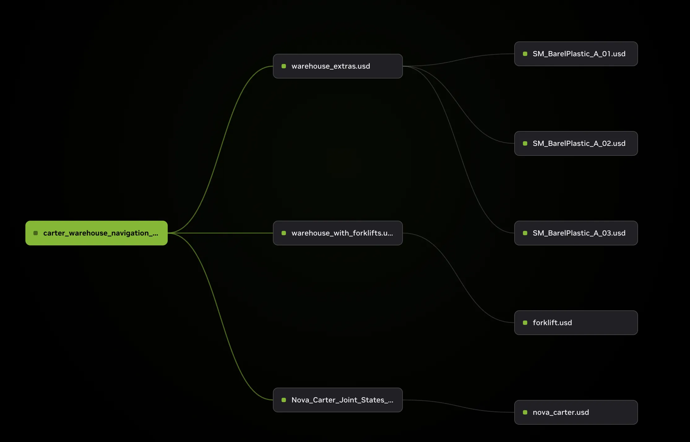
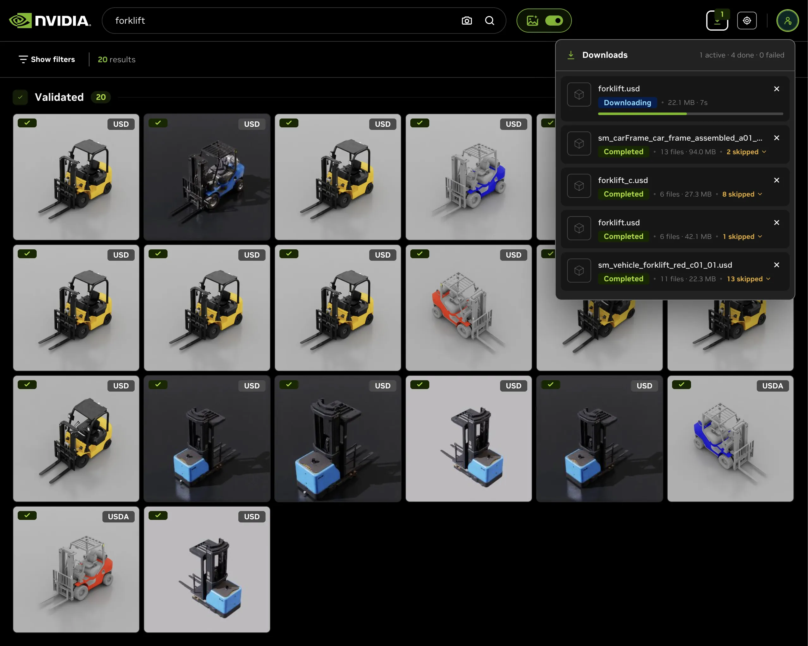

# Beta features

These USD Search capabilities are early-access previews. They work today, but
their interfaces, APIs, and behavior may still change in upcoming releases.
Generally-available features are covered in the main [README](../README.md).

Most of these previews live in the Explorer WebUI. To try them, bring up the
Explorer with the GPU and VLM overlays ([`docs/local-deployment.md`](local-deployment.md))
and configure the shared LLM connection ([`docs/models-and-config.md`](models-and-config.md)).

## Natural-language search

  

Ask in natural language, like "warehouse shelves with rigid body physics under 100MB", and the LLM query parser interprets the request into a structured query, mapping each constraint (file type, size, polygon count, physics flags, custom USD properties) onto the right filter over a per-deployment catalog. Interpreted constraints surface as removable filter chips, so you see exactly how your words were applied. See [`docs/search-filters.md`](search-filters.md).

## Asset Graph Service (AGS): dependency-graph view

  

The Asset Graph Service (AGS) maps how a USD asset is built and where it is used,
and the Explorer renders that map as an interactive node-link graph.

**What it shows**

- The asset's composition: sublayers, references, payloads, and material or
  texture dependencies, expanded transitively.
- Both directions of the graph: forward dependencies (what an asset references)
  and reverse dependencies (which scenes reference this asset).
- Color-coded node types so structure is readable at a glance: **Root**,
  **Component**, and **Material / Texture**.

**How to use it**

- Open any result's detail view, then choose **Dependencies** to switch to the
  graph.
- The canvas is zoomable (mouse wheel) and pannable (drag), so large graphs stay
  navigable.

**What's still preview**

- The graph layout, node grouping, and the detail surfaced per node may change.
- Very large dependency graphs are still being tuned for layout and performance.

AGS also powers the agent-side scene and dependency queries described in the
`search-in-scene` skill (see [`docs/agent-skills.md`](agent-skills.md)).

## One-click bundled download

  

Download any indexed asset as a self-contained ZIP: the root USD plus every
transitive dependency (sublayers, references, textures), with the original folder
structure preserved so the bundle opens and resolves on its own.

**What it does**

- **Complete bundles.** The archive contains the root USD and all of its
  transitive dependencies, paths intact.
- **Pre-flight size preview.** Before committing, a manifest-only request returns
  the file count and total size, so large downloads hold no surprises.
- **A manifest in every archive.** `manifest.json` lists each included file with
  its size, plus anything skipped and why (no access, deleted, or download error).
- **Access-aware.** Only files the requester can access are bundled; skipped
  files are reported in the manifest and in the `X-Download-Summary` response
  header.
- **A real download manager in the Explorer.** Trigger downloads from a result
  card or the detail modal, then watch a sequential queue with live progress,
  cancel, and per-file skip reporting.

**API and configuration**

- Endpoint: `GET /download/asset`. Add `?manifest_only=true` for the pre-flight
  file-count and size preview.
- Tunable through `DOWNLOAD_*` environment variables and the Helm chart
  (concurrency, total size cap, dependency limit, and temp directory).
- Full reference: [`docs/asset-download.md`](asset-download.md).

**What's still preview**

- Defaults for size and dependency caps may be adjusted, and the download-manager
  UI is still evolving.
